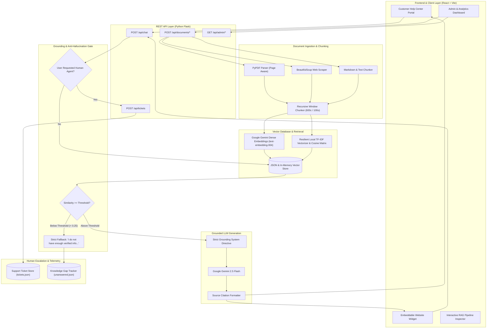

# DocuSupport AI: System Architecture & Technical Specifications

DocuSupport AI is an enterprise-grade, retrieval-augmented generation (RAG) customer support platform designed for verified document grounding, zero-hallucination guardrails, and seamless human escalation.

---

## 1. High-Level System Architecture



---

## 2. Core Architectural Pillars

### 2.1 Multi-Format Document Ingestion
- **PDF Extraction**: Uses `pypdf.PdfReader` to extract text page-by-page. Unlike naive text dumps, page numbers are preserved directly in chunk metadata, enabling precise page citations (`[Doc: ApexCloud SLA, Page: 2]`).
- **Web Scraping**: Uses `requests` and `BeautifulSoup4` with automated DOM cleanup (stripping `<script>`, `<style>`, `<nav>`, `<footer>`) to index help center articles and live FAQ pages.
- **Markdown & Structured Text**: Parses Markdown header hierarchies (`#`, `##`, `###`) to preserve topical sections.

### 2.2 Chunking Strategy & Metadata Architecture
- **Target Size**: 600 characters per chunk with a 100-character sliding overlap.
- **Boundary Preservation**: Splits along paragraph boundaries (`\n\n`) and sentence terminators (`. `, `? `, `! `) before windowing.
- **Metadata Enriched Chunks**: Every chunk is indexed with:
  ```json
  {
    "chunk_id": "doc123_c4",
    "doc_id": "doc123",
    "doc_name": "ApexCloud Pricing and Plans",
    "source_type": "markdown",
    "page_number": 1,
    "section_title": "2. Professional Tier (Pro)",
    "text": "- Price: $29 per user / month (or $24 billed annually)...",
    "char_count": 482,
    "token_estimate": 120
  }
  ```

### 2.3 Dual-Mode Vector Indexing & Resilience
To guarantee 100% testability and reliability out of the box without requiring external API keys:
1. **Google Gemini Dense Embeddings**:
   - Model: `text-embedding-004` (768-dimensional dense vectors).
   - Generates semantic embeddings for query and document chunks.
2. **Resilient Local TF-IDF & Sublinear Cosine Similarity**:
   - Built with `scikit-learn` and `numpy`.
   - Uses sublinear term frequency scaling (`sublinear_tf=True`) and unigram/bigram n-gram ranges (`(1, 2)`).
   - Automatically actives whenever an external API key is absent or offline, delivering instant, deterministic retrieval.

### 2.4 Strict Grounding & Anti-Hallucination Guardrails
To prevent hallucination (a critical criterion for customer support):
1. **Adaptive Similarity Threshold**:
   - Queries scoring below the configurable similarity threshold (`0.25`) are rejected before reaching the LLM.
2. **Refusal System Prompt**:
   - The LLM is instructed under a zero-tolerance policy:
     > *"Answer using ONLY the provided verified context excerpts. If the excerpts do not contain the answer, say 'I cannot find information about this in our verified documents' instead of guessing."*
3. **Automated Knowledge Gap Logging**:
   - Any query triggering fallback is logged in `data/unanswered.json` with its frequency, confidence score, and timestamp for admin review.

### 2.5 Human Handoff & Session Telemetry
- **Intent Recognition**: Matches both regex patterns (`talk to human`, `agent`, `representative`) and direct keyword triggers.
- **Context Preservation**: The customer's entire conversation transcript is attached to the ticket payload, ensuring human engineers have complete context upon assignment.
- **Ticket Lifecycle**: Full CRUD lifecycle (`open` $\to$ `in_progress` $\to$ `resolved`) with internal agent notes.

---

## 3. Data Storage & Schema Design

All data is stored with zero-configuration JSON persistence in `backend/data/`:

| File | Purpose | Key Attributes |
|---|---|---|
| `vector_store.json` | Indexed documents, chunk metadata, vector representations | `documents`, `chunks`, `embeddings`, `saved_at` |
| `tickets.json` | Human escalation cases | `ticket_id`, `customer_name`, `customer_email`, `priority`, `status`, `history`, `agent_notes` |
| `unanswered.json` | Knowledge gaps & deflection telemetry | `metrics` (deflection rate, query counts), `unanswered` registry |

---

## 4. API Reference Summary

| Endpoint | Method | Description |
|---|---|---|
| `/api/health` | `GET` | Health status and indexed document count |
| `/api/config` | `GET`, `POST` | Get or update Gemini API key and RAG thresholds |
| `/api/chat` | `POST` | Execute RAG pipeline with grounded citations |
| `/api/chat/sessions/<id>` | `GET`, `DELETE` | View or clear conversation history |
| `/api/documents` | `GET` | List all indexed documents and stats |
| `/api/documents/upload` | `POST` | Upload and chunk PDF, TXT, or MD |
| `/api/documents/scrape` | `POST` | Scrape and index a website URL |
| `/api/documents/text` | `POST` | Index raw FAQ entry |
| `/api/documents/<id>/chunks` | `GET` | Inspect individual chunks for a document |
| `/api/documents/<id>` | `DELETE` | Remove document and delete its vectors |
| `/api/tickets` | `GET`, `POST` | List tickets or create human handoff ticket |
| `/api/tickets/<id>` | `PATCH`, `DELETE`| Update status/notes or delete ticket |
| `/api/admin/unanswered` | `GET` | List unanswered questions |
| `/api/admin/unanswered/<id>/resolve` | `POST` | Mark query resolved or added to KB |
| `/api/admin/analytics` | `GET` | Real-time deflection rate and query volume |
| `/api/admin/seed` | `POST` | Reset sample documentation |
